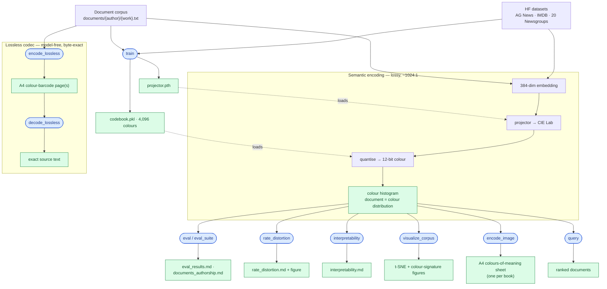

# Colors of Meaning

[](https://github.com/Qualis/colors-of-meaning/actions/workflows/builder.yml)
[](https://github.com/Qualis/colors-of-meaning/actions/workflows/development.yml)
[](https://github.com/Qualis/colors-of-meaning/actions/workflows/service.yml)
[](https://github.com/Qualis/colors-of-meaning/actions/workflows/pr-gate.yml)

**Machine synesthesia for semantic compression and retrieval**

## TL;DR

**Colors of Meaning compresses a 384-dim sentence embedding into a single 12-bit colour over a
4,096-colour CIE-Lab palette — an exact ~1024:1 ratio — and represents any document as a
*distribution of colours*, keeping enough structure to retrieve, classify, interpret, and
even losslessly store meaning.** What this repository demonstrates, end to end:

- **Extreme yet useful compression.** ~1024:1 (12,288 → 12 bits/sentence). On AG News at the
  4,000-sample scale the colour method **classifies at 81.8%** and **retrieves same-class
  documents at MRR 0.85 / recall@5 0.94** — ranked by the same perceptual Wasserstein distance,
  a *measured* retrieval metric, not a relabelled accuracy — against matched-budget TF-IDF /
  HNSW at **86.3% / 88.9%**; the cost of compression is further quantified on a measured
  **rate–distortion frontier** against gzip and Product Quantization.
- **Real prose, not just benchmarks.** A 22-author / 133-work Project Gutenberg corpus is a
  first-class dataset source (author = label, leakage-free work-level train/validation/test
  split). A colour projector trained and *validation-selected* on it reaches **10.8%**
  held-out 22-way authorship accuracy — **~2.4× the 4.5% chance** — vs 37.2% for full-lexical
  TF-IDF. The gap is the honest price of squeezing meaning into 12 bits.
- **Documents you can see.** Each text renders *as colour*: a t-SNE where authors form colour
  neighbourhoods, per-author signatures, and an **A4 colours-of-meaning sheet per book**
  (Darwin's science prose reads as a distinctive bright red, set apart from the fiction's blues and purples).
- **Documents you can store losslessly.** The same texts also encode to printable **A4
  colour-barcode pages that decode back byte-for-byte** — all 133 works round-trip with 0
  failures in a local run; the CI-reproducible proof is the committed *A Christmas Carol* page
  and the codec's round-trip test suite (the barcodes are git-ignored, regenerable artifacts).
- **Interpretable & validated.** Structured-mapper axes (hue↔topic, lightness↔sentiment,
  chroma↔concreteness) pass a falsifiable held-out test against a negative control.

**Measured against the [article](https://www.qual.is/posts/colors-of-meaning)** — ✅ shipped · ◑ partial · ➕ beyond the paper · ⬜ future:

| The article proposed | Where we landed |
|---|---|
| Full pipeline: Lab mapping → 4,096-colour palette → colour-histogram docs → Wasserstein retrieval, + topic / sentiment / search tasks | ✅ shipped |
| Interpretable hue / lightness / chroma axes | ✅ validated against a negative control |
| ~2,000:1 compression (assumes 768-dim embeddings) | ◑ exact ~1024:1 at the shipped 384-dim model |
| "Competitive accuracy with dramatically less space" | ◑ space yes; accuracy trails baselines — cost **measured** (rate–distortion), not hidden |
| Lossless storage (the paper is lossy-only) | ➕ byte-exact A4 colour-barcode codec |
| Other perceptual modalities (sound / touch / taste) | ⬜ future work |

📂 **Full image gallery** (every per-book A4 colour-of-meaning sheet and the lossless colour-barcode
pages): **[Google Drive](https://drive.google.com/drive/folders/1kfENTLEe_Zaw6Q4kcgwTYXuDQwNAo9ap)**
&nbsp;·&nbsp; 📄 **Detailed results:** [document-corpus authorship](reports/documents_authorship.md)
· [scaled multi-dataset eval](reports/eval_results.md) · [rate–distortion](reports/rate_distortion.md)
· [interpretability](reports/interpretability.md)

Authors cluster by colour, and every book becomes an A4 colour signature (one cell per book):


And losslessly — the *exact* bytes: an entire book stored as a single A4 colour-barcode that
decodes back **byte-for-byte**. This is the real artifact, not a mock-up — download it and run
`tox -e decode_lossless -- --input-paths reports/figures/lossless_a_christmas_carol.png` to
recover the full text of *A Christmas Carol*:


## Pipeline & artifacts

How the **processes** (blue) turn text into the **artifacts** (green) — a lossy *semantic* path
(~1024:1) and a separate, model-free *lossless* codec:



`train` produces the **projector + codebook**, which the semantic encoder loads to turn every
document into a **colour histogram**; the downstream processes turn that histogram into reports,
figures, and the per-book A4 colour sheets. The **lossless codec** is a separate, model-free path
(`text → DEFLATE → colour-barcode pages`) that decodes back **byte-for-byte**.

## Project Overview

This project implements the **Colors of Meaning** experiment described in [the research article](https://www.qual.is/posts/colors-of-meaning), which explores a novel approach to semantic understanding through synesthesia.

The core idea is to map semantic embeddings into perceptual color space (CIE Lab), creating a synesthetic representation where documents are color distributions rather than high-dimensional vectors. Rather than working with abstract 384-dimensional embeddings, we translate semantic meaning into the intuitive language of color: hue, lightness, and saturation. This approach achieves ~1024:1 compression — a 384-dim float32 embedding (384 × 32 = 12,288 bits) reduces to a single 12-bit code over a 4,096-color palette (log2(4096) = 12 bits), an exact 12,288 / 12 = 1024:1 ratio — while maintaining interpretable semantic structure, opening new possibilities for understanding how meaning relates to perception.

> **Implemented vs. blog figures:** the referenced [research article](https://www.qual.is/posts/colors-of-meaning) discusses aspirational 768-dim embeddings at ~2000:1; this repository ships 384-dim embeddings at the exact ~1024:1 above.

### Key Features

- **Semantic Color Mapping**: Neural projector maps 384-dim embeddings to 3-dim Lab color space
- **Structured Color Mapping**: Self-supervised projector variant where hue encodes semantic clusters, lightness encodes sentiment, and chroma encodes concreteness
- **Supervised Color Mapping**: Joint optimization of color projection and classification using ground-truth labels; classification head discarded after training
- **Extreme Compression**: 12,288 bits/sentence to 12 bits (4,096-color palette) — an exact ~1024:1 ratio
- **Compression Baselines**: Compare the fixed uniform Lab color grid (nearest-color quantization) against gzip and Product Quantization at matched bit budgets
- **Interpretable Structure**: Hue clusters synonyms, lightness encodes sentiment, saturation distinguishes abstract/concrete
- **Query by Color Palette**: Retrieve documents by specifying Lab colors with weights (CLI and API)
- **Fast Retrieval**: Wasserstein distance on color histograms for document comparison
- **Portable Implementation**: ARM64-safe using hnswlib (no FAISS segfaults)

### Current Performance (AG News Dataset)

A **matched** three-way comparison — colour, TF-IDF, and HNSW all at the same
**4,000-sample** AG News budget and seed 42, from the committed, fidelity-gated
[`reports/eval_results.md`](reports/eval_results.md) (sliced-Wasserstein proxy):

| Method | Budget | Accuracy | Macro F1 | Bits/token |
|--------|--------|----------|----------|------------|
| TF-IDF | 4,000 | 86.30% | 86.24% | — |
| HNSW | 4,000 | 88.90% | 88.90% | 12,288 |
| Color | 4,000 | 81.75% | 81.78% | 12 |

At ~1024:1 compression (12 bits/token over a 4,096-colour palette) the colour method
trails TF-IDF by ~4.5 points and HNSW by ~7 points **at the same sample budget** — the
honest, matched cost of the squeeze, not a full-test-set-vs-400-sample mismatch. (For
reference only: the *published* full-test-set baselines are TF-IDF 90.63% / HNSW 91.99%
— a larger, different budget, not comparable to the colour row above.)

**Retrieval, measured.** Ranked by the same perceptual Wasserstein distance the
classifier uses, colour retrieval scores **MRR 0.85** with **recall@5 0.94** on this
budget (HNSW **0.90 / 0.97**; TF-IDF is classification-only). These are real label-based
retrieval metrics — a same-class document surfacing near the query — not a relabelled
classification number.

**Does structure survive the squeeze?** The single most direct measure is the
structure-preservation Spearman correlation between embedding-space cosine similarity and
colour-space distance: **ρ = −0.3904**. It is negative *by design* — closer meanings map to
closer colours, so higher similarity pairs with smaller distance, and −1 would be perfect
preservation — so **|ρ| ≈ 0.39 is weak-to-moderate** neighbourhood preservation: real
semantic structure survives the 12-bit colour, but a meaningful share is lost. It is printed
by `train` (see [Reproducing the Color Method Result](#reproducing-the-color-method-result)).

For the **scaled, multi-dataset** numbers — AG News at this budget plus **IMDB** and **20
Newsgroups** — see [Scaled, multi-dataset evaluation](#scaled-multi-dataset-evaluation); for the
400-sample exact-EMD headline and the exact commands that regenerate it, see
[Reproducing the Color Method Result](#reproducing-the-color-method-result).

### Reproducing the Color Method Result

The 400-sample Color Method headline (**81.25%** / 81.22%, exact Earth-Mover re-rank) is generated by the committed run configuration
[`configs/agnews_run.yaml`](configs/agnews_run.yaml), which pins `training.seed: 42`,
`training.device: cpu`, `dataset.max_samples: 400`, the 4,096-color codebook, and
exact perceptual Lab Earth-Mover distance (`distance.sinkhorn_reg: null`):

```bash
# 1. Train the supervised color mapper on AG News (also prints the structure-preservation correlation)
tox -e train -- --config configs/agnews_run.yaml --mapper-type supervised

# 2. Persist a color-histogram artifact for query/inspection (optional; eval re-encodes internally)
tox -e encode -- --config configs/agnews_run.yaml --dataset-path data/sample_test.txt

# 3. Evaluate the color method (re-encodes the AG News split internally)
tox -e eval -- --dataset ag_news --method color --config configs/agnews_run.yaml --mapper-type supervised
```

Step 1 prints `Structure-preservation correlation: -0.3904` — the Spearman rank
correlation between embedding-space cosine similarity and color-space distance
([P0-5](.specs/005-p0-5-determinism-structure-metric/SPEC.md)). It is negative by
design: closer meanings map to closer colors, so higher similarity pairs with smaller
color distance. Step 3 prints that 400-sample Accuracy / Macro-F1 (**81.25%** / 81.22%) — the matched-budget comparison below.

**Artifacts** (regenerated locally; kept out of version control by `.gitignore`):

- `artifacts/models/projector.pth` — trained projector weights
- `artifacts/codebooks/codebook_4096.pkl` — 4,096-color Lab codebook
- `artifacts/encoded/test_documents.pkl` — persisted color histograms (step 2)

**Matched-budget comparison at 400 samples** — the exact-EMD headline run: all three methods
at `max_samples: 400`, seed 42, a fair head-to-head (a smaller budget than the 4,000-sample
matched table above, but with an exact Earth-Mover re-rank rather than the sliced proxy):

| Method | Accuracy | Macro F1 |
|--------|----------|----------|
| TF-IDF | 82.00% | 81.79% |
| HNSW | 85.25% | 85.14% |
| Color (supervised) | 81.25% | 81.22% |

Regenerate the matched-budget baselines with:

```bash
tox -e eval -- --dataset ag_news --method tfidf --config configs/agnews_run.yaml
tox -e eval -- --dataset ag_news --method hnsw --config configs/agnews_run.yaml --k-neighbors 5
```

**Reproducibility and tolerance.** Training honours `training.seed`
([P0-5](.specs/005-p0-5-determinism-structure-metric/SPEC.md)), so on the reference
environment (CPU, PyTorch 2.x, the pinned dependency set) re-running the sequence
regenerates **bit-identical** projector weights and therefore the **exact** Accuracy
(81.25%), Macro-F1 (81.22%), and correlation (−0.3904) — tolerance ±0.00. The color
evaluation is deterministic given fixed weights (seeded single-thread HNSW build,
deterministic projector forward pass, exact EMD). Across different hardware or library
versions, expect drift of up to ~±1 percentage point on Accuracy / Macro-F1 and ~±0.02
on the Spearman correlation; for stricter cross-run guarantees add `--deterministic` to
the train command (`torch.use_deterministic_algorithms(True)`). The committed run
config and these tolerances are version-controlled so the figure stays attributable.

### Scaled, multi-dataset evaluation

The 400-sample headline rests on the **exact** Earth-Mover re-rank
(`ot.emd2` over the 4,096×4,096 perceptual Lab cost matrix, ~92 ms/call), so a full
test set is hours of compute. To report **honest numbers at scale and across
datasets**, the color histogram classifier can re-rank candidates with a fast,
**metric** proxy — **sliced-Wasserstein** over the same fixed Lab support
(`--distance sliced`) — that orders documents almost identically to exact EMD at a
fraction of the cost.

The speed-up is **measured, not assumed**. Before any scaled number is trusted, a
**fidelity gate** compares the proxy against exact EMD on held-out document pairs and
**fails loudly** unless:

- Spearman rank-correlation of the proxy vs exact distances is **≥ 0.95**, and
- the downstream accuracy delta is **≤ 1.0 point**.

A single command runs the gate, then evaluates each (dataset, budget) cell, and writes
the committed evidence to [`reports/eval_results.md`](reports/eval_results.md) — one row
per cell with accuracy, macro-F1, budget, distance, and wall-clock:

```bash
tox -e eval_suite -- \
  --datasets ag_news imdb newsgroups \
  --distance sliced \
  --budgets 4000 600 600 \
  --config configs/agnews_full.yaml \
  --mapper-type unconstrained
```

`--budgets` records one budget per dataset (AG News at the ≥4,000 headline scale; the
longer IMDB/20 Newsgroups documents at a smaller, recorded budget). Omit it for a
uniform `--budget`. The committed `projector.pth` is the AG-News-trained projector;
its forward pass is identical whether loaded as `unconstrained` or `supervised`, so the
mapper-type label does not change the colors.

The committed [`reports/eval_results.md`](reports/eval_results.md) is the auditable
source for the AG News (large-budget), **IMDB** (binary sentiment), and **20
Newsgroups** (20-class topic) color-method numbers and the exact command that produced
them. Each cell records its **budget** so a large-budget number is never confused with
the 400-sample headline, and the run is deterministic given a fixed seed (`training.seed`,
fixed sliced-projection seed, single-thread HNSW build). The `eval` CLI also accepts
`--distance {wasserstein,sliced,sinkhorn,jensen_shannon}` and `--max-samples` for a
single dataset.

**Fidelity gate (sliced proxy vs exact EMD):** Spearman **0.9916** over 1,200 held-out
AG News document pairs (≥ 0.95 ✓), accuracy delta **0.0 pt** (≤ 1.0 ✓) — measured as
`color`/`sliced` vs `color`/`wasserstein` at the 400-sample budget, both **81.25%**. The
sliced proxy is ~200× faster than exact EMD on these sparse histograms (restricted to the
union of each pair's non-zero bins), so scaling becomes feasible without changing the
ranking.

**Committed color-method results** (sliced proxy, from `reports/eval_results.md`):

| Dataset | Classes | Budget | Accuracy | Macro F1 |
|---------|---------|--------|----------|----------|
| AG News | 4 | 4,000 | 81.75% | 81.78% |
| IMDB | 2 | 600 | 54.83% | 54.78% |
| 20 Newsgroups | 20 | 600 | 16.50% | 15.35% |

These are **honest cross-dataset numbers**, not cherry-picked. The projector is trained on
AG News, so the color mapping captures topic semantics: at 4,000 samples AG News holds
**81.75%** (in line with — slightly above — the 400-sample 81.25% headline), confirming the
method scales. The same fixed projector transfers **weakly** to IMDB sentiment (54.8%, just
above the 50% binary chance — topic-trained colors do not encode sentiment) and **modestly**
to 20 Newsgroups (16.5%, ~3.3× the 5% 20-class chance). Per-dataset retraining of the
projector is future work; these rows document the out-of-the-box generalization of an
AG-News-trained color map.

### Project Status

- ✅ **Phase 1**: Core infrastructure (color mapping, encoding, compression)
- ✅ **Phase 2**: Evaluation pipeline and baselines
- ✅ **Phase 3**: Visualizations (codebook palette, histograms, t-SNE projections, confusion matrices)
- ✅ **Phase 4**: Structured color mapping, compression comparison baselines, query by color palette
- ✅ **Phase 5**: Supervised color mapping with joint projection + classification training

**Quality Gates**: All passing (ruff check, ruff format, bandit, semgrep, radon, xenon, mypy, pip-audit, 100% coverage)

## Quick Start

### Evaluate Baselines (No Training Required)

```bash
# TF-IDF baseline (fast, ~12 seconds)
tox -e eval -- --dataset ag_news --method tfidf

# HNSW embedding baseline (slower, ~30 minutes)
tox -e eval -- --dataset ag_news --method hnsw --k-neighbors 5
```

### Train and Evaluate Color Method

Reproduces the **Color Method** row in the performance table above (supervised mapper on AG News):

```bash
# Step 1: Train the supervised color mapper on AG News (prints the structure-preservation correlation)
tox -e train -- --config configs/agnews_run.yaml --mapper-type supervised

# Step 2: Evaluate the color method
tox -e eval -- --dataset ag_news --method color --config configs/agnews_run.yaml --mapper-type supervised
```

See [Reproducing the Color Method Result](#reproducing-the-color-method-result) for the committed run config, artifact paths, matched-budget baselines, and the reproducibility tolerance.

### Train the Structured Color Mapper

The structured mapper uses explicit heads for hue (semantic clusters), lightness (sentiment), and chroma (concreteness), trained with a multi-objective loss. The lightness head reads sentiment from the dataset labels, so it needs a config that sets `structured_mapper.sentiment_source: labels` over a sentiment-labelled dataset. `configs/interpretability.yaml` pins IMDB and is the command that produced the committed `structured_projector.pth`:

```bash
tox -e train -- --config configs/interpretability.yaml --mapper-type structured \
  --output-model artifacts/models/structured_projector.pth \
  --output-codebook interpretability_codebook
```

`configs/structured.yaml` leaves `sentiment_source` at `none`, which trains the same heads against a neutral lightness target from a line-delimited corpus passed with `--dataset-path`.

### Interpretability (Validated)

The structured mapper is *trained toward* hue=topic-cluster, lightness=sentiment, and
chroma=concreteness targets, so on the training split the "hue means topic, lightness
means sentiment, chroma means concreteness" claim is true **by construction**. That is
not yet science: a network can satisfy its training targets without the axes carrying
that meaning on unseen data.

The `interpretability` CLI makes the claim **falsifiable**. On a held-out split it measures
three independent correlations — hue↔topic (normalized mutual information), lightness↔sentiment
(point-biserial/Spearman), and chroma↔concreteness (Spearman over the bundled Brysbaert
concreteness lexicon, offline) — for the structured mapper **and** for a negative control
(an untrained noise projector, or an unconstrained mapper never trained toward these axes).
Interpretability is asserted only where the structured mapper's **margin over the control**
clears a documented threshold; any axis that fails is reported as a **falsification**, not a
pass. This mirrors the structure-preservation evaluator: the numerics (`scikit-learn`/`scipy`)
live behind a domain port (`InterpretabilityEvaluator`), so the domain layer stays pure.

```bash
# Structured mapper vs an untrained noise control on a held-out IMDB split
tox -e interpretability -- \
  --config configs/interpretability.yaml \
  --dataset imdb \
  --structured-model artifacts/models/structured_projector.pth \
  --control noise
```

The per-axis structured/control/margin table and the VALIDATED/FALSIFIED verdict are written
to the committed [`reports/interpretability.md`](reports/interpretability.md), regenerable from
the command above.

### Train the Supervised Color Mapper

The supervised mapper jointly optimizes color projection and classification using ground-truth labels. The classification head is discarded after training; only the projector weights are saved.

```bash
tox -e train -- --config configs/supervised.yaml --mapper-type supervised
```

### Query by Color Palette

Retrieve documents matching a color distribution specified as Lab colors with weights:

```bash
tox -e query -- \
  --palette-json '[{"l": 75, "a": 20, "b": -10, "weight": 1.0}]' \
  --codebook-name codebook_4096 \
  --encoded-documents artifacts/encoded/test_documents.pkl \
  --k 5
```

### Compare Compression Baselines

Compare the fixed uniform Lab color grid against gzip and Product Quantization:

```bash
tox -e compress -- --compare-baselines --embeddings-path artifacts/encoded/test_embeddings.npy
```

### Rate–Distortion Frontier

The ~1024:1 ratio is a single operating point. Sweep the bit budget to turn it into a
measured **rate–distortion frontier** — color-VQ over grid resolutions (`bins_per_dimension`
∈ {2, 4, 8, 16} → 3/6/9/12 bits), Product Quantization matched to the same bits, and gzip as
one data-dependent point — recording both native distortion (ΔE for color-VQ, MSE for gzip/PQ)
and the color method's downstream retrieval accuracy at each budget:

```bash
tox -e rate_distortion -- --dataset ag_news --budgets 2 4 8 16 --methods color_vq gzip pq --with-accuracy --distance jensen_shannon --max-samples 200 --config configs/base.yaml
```


The committed [`reports/rate_distortion.md`](reports/rate_distortion.md) holds the frontier table
and the matched-budget comparison (color-VQ vs PQ at equal bits-per-token). On AG News, color-VQ's
ΔE falls from ~117 at 3 bits to ~6.8 at 12 bits while gzip stays lossless at ~11,000 bits/token —
the squeeze costs perceptual distortion and, past 9 bits, some retrieval accuracy.

#### Running on your own document corpus

The same frontier can be measured over **real prose you supply** instead of the built-in
labelled datasets. Drop UTF-8 `.txt` files under a git-ignored `./documents/` tree following the
convention `documents/<author>/<work>.txt` — the immediate parent directory names the **author**
(which becomes the classification label) and the filename names the **work**:

```
documents/
  austen/pride_and_prejudice.txt
  austen/emma.txt           # many works per author all count toward that author
  darwin/origin_of_species.txt
  darwin/voyage_of_the_beagle.txt
```

Each work is stripped of Project Gutenberg boilerplate and split into paragraph-level samples.
Authors are sorted lexicographically and given contiguous integer labels for cross-machine
determinism. The corpus is partitioned into a **three-way train / validation / test split**: by
default (`--split-strategy work`) whole works are held out per author into each split (controlled by
`--validation-fraction` / `--test-fraction`, default 0.2 / 0.2 → roughly 60/20/20), so the
author-accuracy axis measures generalisation to unseen works rather than memorising one. Authors
with fewer than three works fall back to a paragraph-level three-way split, and authors yielding
fewer than three qualifying paragraphs are skipped. Point the sweep at the corpus with `--source
documents`:

```bash
tox -e rate_distortion -- --source documents --documents-dir ./documents --min-paragraph-chars 200 --paragraphs-per-work 60 --validation-fraction 0.2 --test-fraction 0.2 --with-accuracy
```

(The retrieval eval fits on the `train` split and scores `test`; the `validation` split is produced
for future projector model-selection — pick the checkpoint on validation, report final on test.)

Because `./documents/` is git-ignored, a documents-sourced frontier is a local, opt-in run and is
not regenerated in CI; the committed AG News frontier above remains the reproducible one.

### Authorship report and figures

The authored-corpus authorship artifacts — [`reports/documents_authorship.md`](reports/documents_authorship.md)
and its committed figures (`documents_color_tsne.png`, `documents_color_signatures.png`, the 133
per-book `reports/figures/a4/<author>__<work>.png` sheets, and the `documents_a4_gallery.png` contact
sheet) — regenerate from committed commands, like every other report. The figures are deterministic
(byte-identical across runs) and read each book's colour through the trained documents projector:

```bash
tox -e visualize_documents -- --config configs/documents.yaml \
  --model-path artifacts/models/projector_documents_valsel.pth --codebook-name codebook_documents_valsel
```

The report writes its computed tables (corpus authors/works, per-split paragraph counts, held-out
colour vs TF-IDF results) from a real held-out train/eval, mirroring how `eval_suite` writes
`eval_results.md`; the narrative prose is a fixed template. The multi-seed data-scaling table is read
from the committed [`reports/data/authorship_scaling.json`](reports/data/authorship_scaling.json)
manifest by default, so the report regenerates fast without re-training; `--refresh-scaling` re-runs
the long, non-CI 8-seed × 3-cap training sweep and rewrites the manifest:

```bash
tox -e authorship -- --config configs/documents.yaml \
  --model-path artifacts/models/projector_documents_valsel.pth --codebook-name codebook_documents_valsel \
  --mapper-type supervised --paragraphs-per-work 60
```

Because `./documents/` is git-ignored, these are local, opt-in runs not regenerated in CI. Book
generation (`reports/book/*`) is the one authored artifact with **no** reproducible command: it is
owned by `tox -e generate`, needs a live API key, and the LLM is non-deterministic (no seed), so
byte-for-byte reproduction is impossible by construction and no new environment is warranted for it —
see [Generate a book](#generate-a-book).

### Narrative Compass

The network is a lossy encoder — it maps a 384-dim embedding to a colour and never runs in reverse,
so it cannot *write* a book. But the same machinery can **plan and audit** one. Give the `compass`
CLI an ordered story outline (headings or blank lines delimit the beats) and it reads the outline as
a measured **colour trajectory**: each beat's colour is read from its *whole-text* embedding through
the structured mapper — so **lightness tracks sentiment, chroma tracks concreteness, and hue tracks
topic** — while each beat is also rendered as a colour *histogram* to measure **drift** (perceptual
distance between consecutive beats) and **coherence** (distance to the whole-book palette). Beats
whose coherence exceeds a threshold are flagged as off-key.

The beat colour is read from the beat's document embedding, never the mean of its sentence colours:
averaging Lab across sentences cancels chroma (`sqrt(a² + b²)`) and would silently destroy the
concreteness axis. The drift/coherence reading deliberately uses a histogram — a distribution, not
an average — which is exactly what a `ColoredDocument` represents.

```bash
tox -e compass -- --outline outlines/sample_story.md --config configs/structured.yaml --model-path artifacts/models/structured_projector.pth --codebook-name codebook_4096 --mapper structured --metric sliced --min-beat-chars 200 --drift-threshold 36.5
```


The committed sample outline is a seven-chapter arc with one deliberately off-key beat — a *Quarterly
Earnings Review* dropped into a seafaring coming-of-age story. The compass isolates it: its hue flips
to 16° while every narrative chapter sits near 195°, its lightness dips, and it is the single beat
whose colour histogram sits farthest from the whole-book palette. The per-beat table and flags are
written to the committed [`reports/story_compass.md`](reports/story_compass.md) and the figure above,
both regenerable from the command shown. It never calls an external service, so it is fully
CI-reproducible; feature 024 (Claude-backed generation) consumes this arc for coherence QA.

### Grounding audit

The compass measures a story beat against its whole-book palette; the **grounding audit** points the
same *coherence* reading at retrieval. A retrieval-augmented answer is supposed to stay inside what was
retrieved, so the `grounding` CLI encodes the **answer** and each **retrieved passage** as colour
histograms over the 4,096-colour codebook and measures the perceptual distance from the answer to the
uniform **mixture** of the passage histograms. A small divergence means the answer's semantic-colour
mass sits inside the retrieved evidence; a large one means the answer has wandered off it — a cheap,
interpretable **off-context / drift signal** for RAG. The context palette is a mixture of *distributions*,
never a mean of Lab colours (which would cancel chroma), reusing the same embedder, codebook, encode
path, and `DistanceCalculator` ports as the rest of the pipeline — no new dependency.

**This is a distributional off-context signal, not a factuality or citation checker.** A large divergence
is a strong smell that the answer is topically unsupported by the retrieved passages; a small divergence
does **not** certify factual correctness — only that the answer's colour distribution lies within the
context's. It inherits the 384→3 lossy bottleneck, so it is a coarse triage instrument, and the threshold
is corpus- and metric-dependent, not a universal constant.

```bash
tox -e grounding -- --sample samples/rag_grounding.yaml --config configs/base.yaml --model-path artifacts/models/projector.pth --codebook-name codebook_4096 --mapper plain --metric sliced --threshold 25
```

The committed sample asks *"What causes rain in the water cycle?"* with three retrieved passages and two
candidate answers: a grounded summary of the passages and an off-context answer about central-bank interest
rates. The audit isolates the drift — the grounded answer scores **12.24** and the off-context answer
**49.53** against the flagging threshold of **25**, so the fabricated-topic answer is flagged and the
grounded one is not. The per-answer verdict table is written to the committed
[`reports/grounding_audit.md`](reports/grounding_audit.md), regenerable from the command shown. It never
calls an external service, so it is fully CI-reproducible.

### Generate a book

The compass plans and audits; it cannot *write*. Writing comprehensible prose needs the opposite kind
of model — an autoregressive language model — so the `generate` CLI adds one behind a provider-agnostic
`TextGenerator` port and pairs it with the compass: **an LLM writes the book and the colour pipeline
plans and audits it.** From a one-paragraph summary the `GenerateBookUseCase` asks the generator for a
structured **outline** of beats, writes each chapter in order with the preceding chapters in context,
and after each beat runs the narrative compass over the beats so far. A chapter whose colour signature
drifts beyond the threshold is **regenerated once or twice with a corrective note** (a bounded retry
budget); if it still drifts it is recorded in the book's *flagged beats* rather than silently accepted.

The generator is Claude, reached through the official `anthropic` SDK behind the `TextGenerator` port,
so the domain and application layers stay provider-agnostic. The adapter defaults to `claude-opus-4-8`
with adaptive thinking and `effort: high`; it plans the outline with **structured outputs**
(`messages.parse`) and streams each chapter with `messages.stream().get_final_message()`, caching the
summary-plus-outline "bible" so per-beat calls only pay for the delta. Refusals and typed API errors
surface as a domain-level `GenerationError`.

```bash
export ANTHROPIC_API_KEY=sk-ant-...   # required — generation needs a live key
tox -e generate -- --summary "A lighthouse keeper on a fog-bound coast befriends the ghost of a drowned sailor." --num-beats 6 --words-per-beat 500 --tone "sombre, tender" --config configs/structured.yaml --model-path artifacts/models/structured_projector.pth
```

Chapters are written to `reports/book/NN_<title>.md`, the compass audit to `reports/book/arc.md`, and
the arc figure to `reports/figures/story_book.png`. **This is the first feature that needs a live API
key and therefore is not run in CI**: the whole unit suite mocks the SDK client (no network, a
consumer-driven contract test pins the request shape), and a generated book is a local, opt-in artifact
— the compass report above remains the CI-reproducible colour artifact.

**Example run** (one output; needs a key, so it is not committed and not CI-reproducible — re-run the
command to produce your own). From the summary above, `claude-opus-4-8` wrote a six-chapter lighthouse
ghost story (~520 words per chapter, ~16.1k input / 7.2k output tokens) and the compass passed it clean
— **0 chapters regenerated, 0 flagged**, coherence 5.6–18.2 against the 25 threshold. The audit is the
interesting part: lightness and hue both dip through *The Wreck Remembered* and *The Failing Light* (the
flashback and the crisis) and recover at the finale *Slack Water*, with the largest beat-to-beat drift
at the tonal turn into chapter two. The colour trajectory follows the story's emotional arc — which the
pipeline only ever read as an embedding, never as prose.

### Generate Visualizations

```bash
# Codebook palette
tox -e visualize -- --visualization-type codebook

# Document color histograms
tox -e visualize -- --visualization-type histograms --dataset ag_news --max-samples 50

# t-SNE projection of color distributions
tox -e visualize -- --visualization-type projection --dataset ag_news --max-samples 200

# Confusion matrix
tox -e visualize -- --visualization-type confusion_matrix --dataset ag_news --method color
```

## CLI Reference

All CLI tools are available via tox environments or as Python modules directly.

### Training

Train the embedding-to-color projector:

```bash
# Unconstrained projector (default) — reads a line-delimited text corpus
tox -e train -- --config configs/base.yaml --dataset-path data/sample_train.txt

# Structured projector (hue=semantics, lightness=sentiment, chroma=concreteness)
tox -e train -- --config configs/interpretability.yaml --mapper-type structured

# Supervised projector (joint projection + classification)
tox -e train -- --config configs/supervised.yaml --mapper-type supervised
```

**Arguments**:
- `--config`: Configuration YAML file (default: `configs/base.yaml`)
- `--dataset-path`: Line-delimited text corpus, one document per line, used by the mapper types that train on free text (default: `data/train.txt`, which is **not** committed — pass your own corpus, or `data/sample_train.txt` for a five-line smoke run)
- `--output-model`: Output path for trained model (default: `artifacts/models/projector.pth`)
- `--output-codebook`: Output name for color codebook (default: `codebook_4096`)
- `--mapper-type`: Projector variant to train: `unconstrained` (default), `structured`, or `supervised`

The structured mapper trains with a multi-objective loss combining angular hue loss, MSE lightness loss, and MSE chroma loss, weighted by alpha/beta/gamma from the config. Hue targets are k-means clusters over the embeddings, ordered by centroid so neighbouring hues carry neighbouring meanings. Lightness and chroma targets come from real signals rather than the embeddings: the dataset's sentiment labels when `sentiment_source: labels` is set, and the bundled Brysbaert concreteness lexicon scored over the training texts. Without those inputs each falls back to a constant target (neutral lightness, half of `max_chroma`), which trains the head toward no signal at all.

The supervised mapper trains with a combined loss: MSE projection loss + classification_weight * CrossEntropyLoss. It loads labeled data from a dataset adapter (AG News, IMDB, or 20 Newsgroups) rather than a plain text file. The classification head is discarded after training.

### Encoding

Encode documents to color histograms:

```bash
tox -e encode -- --config configs/base.yaml --split test
```

**Arguments**:
- `--config`: Configuration YAML file (default: `configs/base.yaml`)
- `--split`: Dataset split (`train`, `test`)
- `--model-path`: Path to trained model (default: `artifacts/models/projector.pth`)
- `--codebook-name`: Color codebook name (default: `codebook_4096`)
- `--output-path`: Output path for encoded documents (default: `artifacts/encoded/test_documents.pkl`)

### Comparison

Compare documents via color distance:

```bash
tox -e compare -- --config configs/base.yaml --k 5
```

**Arguments**:
- `--config`: Configuration YAML file (default: `configs/base.yaml`)
- `--encoded-documents`: Path to encoded documents (default: `artifacts/encoded/test_documents.pkl`)
- `--k`: Number of nearest neighbors to find (default: 5)
- `--query-index`: Index of query document (default: 0)

### Compression

Analyze compression ratios and compare against baselines:

```bash
# Fixed-grid color compression analysis
tox -e compress -- --config configs/base.yaml

# Compare against gzip and Product Quantization baselines
tox -e compress -- --compare-baselines --embeddings-path artifacts/encoded/test_embeddings.npy
```

**Arguments**:
- `--config`: Configuration YAML file (default: `configs/base.yaml`)
- `--embeddings-path`: Path to raw float32 embeddings to compress (default: `artifacts/encoded/test_embeddings.npy`)
- `--model-path`: Path to the trained projector model (default: `artifacts/models/projector.pth`)
- `--codebook-name`: Color codebook name (default: `codebook_4096`)
- `--compare-baselines`: Run gzip and Product Quantization baselines instead of the fixed-grid color analysis (default: `false`)

When `--compare-baselines` is enabled, the tool loads raw float32 embeddings and runs gzip (lossless) and Product Quantization (M=48 subspaces, k=256 centroids) baselines, reporting compression ratio, bits per token, and reconstruction error (MSE) for each method.

The default (non-baseline) analysis quantizes projector outputs against a **fixed uniform Lab color grid** (`ColorCodebook.create_uniform_grid`) by nearest-color assignment — a static, hand-specified palette, not a learned vector-quantization codebook. Learned VQ arrives with [`007-p1-1-learned-vq-codebook`](.specs/007-p1-1-learned-vq-codebook/SPEC.md), after which the "VQ" terminology becomes accurate.

### Evaluation

Evaluate classification performance with different methods:

```bash
# Evaluate on AG News (4-class topic classification)
tox -e eval -- --dataset ag_news --method tfidf

# Evaluate on IMDB (binary sentiment classification)
tox -e eval -- --dataset imdb --method tfidf

# Evaluate on 20 Newsgroups (20-class topic classification)
tox -e eval -- --dataset newsgroups --method hnsw --k-neighbors 10
```

**Arguments**:
- `--dataset`: Dataset to evaluate on (`ag_news`, `imdb`, `newsgroups`)
- `--method`: Method (`tfidf`, `hnsw`, `color`)
- `--task`: `classification` (default) or `retrieval`
- `--k-neighbors`: Number of neighbors for k-NN methods (default: 5)
- `--k-values`: Cut-offs for retrieval recall@k / NDCG@k (default: `1 5 10`)
- `--config`: Configuration file (default: `configs/base.yaml`)
- `--model-path`: Path to trained projector model (default: `artifacts/models/projector.pth`)
- `--codebook-path`: Color codebook name (default: `codebook_4096`)

Measure retrieval quality (real MRR and recall@k, ranked by the same perceptual
distance the classifier uses) instead of classification:

```bash
# Colour-histogram retrieval, ranked by Wasserstein distance
tox -e eval -- --dataset ag_news --method color --task retrieval --k-values 1 5 10 --config configs/agnews_run.yaml

# Embedding-space retrieval baseline (hnswlib L2 index)
tox -e eval -- --dataset ag_news --method hnsw --task retrieval --k-values 1 5 10
```

Retrieval metrics are **label-based** (relevance = shared class label): recall@k is
"a same-class document appears in the top k" and MRR is `1 / rank` of the first
same-class hit. This is the standard metric-learning Recall@K convention and is
correlated with the k-NN classification accuracy by construction — a ranking-quality
view of the same neighbourhoods, not human-judged IR. `tfidf` is classification-only
and is skipped (with a reason) under `--task retrieval`.

### Visualization

Generate visualizations of the color mapping pipeline. Output is saved to `reports/figures/`.

```bash
# Codebook palette (4,096-color swatch grid)
tox -e visualize -- --visualization-type codebook

# Document color histograms by class
tox -e visualize -- --visualization-type histograms --dataset ag_news --max-samples 50

# t-SNE projection of color distributions
tox -e visualize -- --visualization-type projection --dataset ag_news --max-samples 200

# Confusion matrix for a classification method
tox -e visualize -- --visualization-type confusion_matrix --dataset ag_news --method color
```

**Arguments**:
- `--visualization-type`: Type of visualization (`codebook`, `histograms`, `projection`, `confusion_matrix`)
- `--config`: Configuration YAML file (default: `configs/base.yaml`)
- `--dataset`: Dataset to visualize (`ag_news`, `imdb`, `newsgroups`)
- `--method`: Classification method for confusion matrix (`color`, `tfidf`, `hnsw`)
- `--model-path`: Path to trained model (default: `artifacts/models/projector.pth`)
- `--codebook-name`: Color codebook name (default: `codebook_4096`)
- `--k-neighbors`: Number of neighbors for k-NN methods (default: 5)
- `--output-dir`: Output directory for figures (default: `reports/figures`)
- `--max-samples`: Maximum number of samples to process (default: 500)

### Compare Text Corpora by Color

Render side-by-side **color-signature** and **t-SNE** figures comparing several labelled text corpora (e.g. books by different authors). Each corpus is one label; paragraphs are encoded to color histograms, then a per-corpus mean color signature and a t-SNE projection (points colored by corpus) are written to `--output-dir`.

```bash
tox -e visualize_corpus -- \
  --corpus-specs "Darwin=data/darwin.txt,Smith=data/smith.txt,Austen=data/austen.txt" \
  --paragraphs-per-corpus 60
```

**Arguments**:
- `--corpus-specs`: Comma-separated `label=path` pairs, one per corpus (default: `sample=data/sample_train.txt`)
- `--config`: Configuration YAML file (default: `configs/base.yaml`)
- `--model-path`: Path to trained projector model (default: `artifacts/models/projector.pth`)
- `--codebook-name`: Color codebook name (default: `codebook_4096`)
- `--output-dir`: Output directory for figures (default: `reports/figures`)
- `--paragraphs-per-corpus`: Body paragraphs sampled per corpus (default: 60)
- `--min-paragraph-chars`: Minimum characters for a paragraph to count as a document (default: 200)
- `--top-colors`: Number of dominant colors shown per corpus signature (default: 24)

Requires pre-built projector and codebook artifacts; raw text files have any Project Gutenberg boilerplate stripped and are sampled from the body. Outputs `corpus_color_signatures.png` and `corpus_color_tsne.png`.

### Encode a Document as an A4 Image

Turn a single document into one printable **A4 "colors of meaning" image** — a perceptual rendering of its semantic color distribution that prints at true A4 size (2480×3508 px at 300 DPI, with embedded DPI metadata). Colors are the genuine `Lab → RGB` of each codebook bin, so the page is an honest artifact rather than a content-cropped figure.

```bash
# Recoverable score image: one perceptual cell per sentence, in reading order
tox -e encode_image -- --text "Markets fell sharply today. Investors fled to bonds." --layout score

# Aesthetic posters of the document's color distribution
tox -e encode_image -- --dataset-path data/sample_test.txt --index 0 --layout signature
tox -e encode_image -- --dataset-path data/sample_test.txt --index 0 --layout mosaic
```

**Arguments**:
- `--text`: Inline document text (takes precedence over `--dataset-path`)
- `--dataset-path`: Text file, one document per line; encodes the `--index` document (default: `data/sample_test.txt`)
- `--index`: Index of the document to encode from `--dataset-path` (default: 0)
- `--layout`: `score` (recoverable, one cell per sentence), `signature` (proportional bands), or `mosaic` (frequency-tinted codebook grid) (default: `score`)
- `--dpi`: Output resolution; A4 pixel size scales with DPI (default: 300)
- `--config`: Configuration YAML file (default: `configs/base.yaml`)
- `--model-path`: Path to trained projector model (default: `artifacts/models/projector.pth`)
- `--codebook-name`: Color codebook name (default: `codebook_4096`)
- `--output-path`: Output PNG path (default: `reports/figures/document_a4.png`)

The `score` layout is **decodable**: re-reading the page samples each cell's perceptual color and re-quantizes it to recover a color histogram. Because the codebook includes out-of-gamut Lab points that `lab_to_rgb` clips, the perceptual round-trip is *approximate* on the full 4,096-color codebook (exact on a coarse in-gamut codebook), which is sufficient to retrieve the source document by color distance. The original *text* is intentionally not recoverable — the 384-dim → 3-dim projection is lossy by design.

```bash
# Decode a score image and retrieve its source document from an encoded corpus
tox -e decode_image -- \
  --image-path reports/figures/document_a4.png \
  --encoded-documents artifacts/encoded/test_documents.pkl \
  --k 5
```

**Arguments**:
- `--image-path`: Path to the A4 score image to decode (default: `reports/figures/document_a4.png`)
- `--codebook-name`: Color codebook name (default: `codebook_4096`)
- `--encoded-documents`: Encoded corpus for nearest-document retrieval; omit to print only the recovered histogram summary (default: none)
- `--k`: Number of nearest documents to return (default: 5)

### Encode a Document Losslessly

Where the A4 image above is **lossy and semantic** — the colors *mean* something (a perceptual projection) and the source text cannot be recovered — this codec is **lossless and model-free**. The page is a **color barcode**: each cell's color is a *data symbol* (a byte), not a meaning. There is no embedding, projector, or Lab codebook involved — `text → UTF-8 → DEFLATE → CRC-framed pages → palette cells → A4 PNG` — so encoding and decoding need **no trained artifacts** and recover the **exact original text, byte-for-byte**.

```bash
# Encode any text into printable A4 color-barcode page(s)
tox -e encode_lossless -- --text "The exact bytes of this sentence are recoverable."
tox -e encode_lossless -- --input-path reports/austen_pride.txt --output-path reports/figures/austen.png
```

**Arguments**:
- `--text`: Inline document text (takes precedence over `--input-path`)
- `--input-path`: UTF-8 text file read whole as one document
- `--output-path`: Output PNG path; multi-page runs insert `_p01`, `_p02`, … before the extension (default: `reports/figures/document_exact.png`)
- `--dpi`: Output resolution; A4 pixel size scales with DPI (default: 300)
- `--cell-size`: Pixels per module; smaller is denser (fewer pages) but less print-robust (default: 4)

A document larger than one A4 page is split across the **minimal number of pages**; each page self-describes its `(page_index, page_count)` and carries a CRC32, so the pages decode correctly **in any order** and a missing, duplicated, or corrupted page raises rather than returning wrong text.

Each page **fills the whole A4 sheet**: `--cell-size` fixes the number of columns (cell width), and the rows adapt to exactly the content the page carries, so a short document stretches to the full height instead of leaving a flat padding block at the bottom. The decoder reads the page's header from its top row to recover the row count, so no extra metadata is needed.

```bash
# Decode page(s) back to the exact source text (single path, comma-list, or glob)
tox -e decode_lossless -- --input-paths "reports/figures/document_exact.png"
tox -e decode_lossless -- --input-paths "reports/figures/austen_p*.png" --output-path reports/austen_recovered.txt
```

**Arguments**:
- `--input-paths`: One path, a comma-separated list, or a glob of the page PNGs (default: `reports/figures/document_exact.png`)
- `--output-path`: Write the recovered text here; omit to echo it to stdout (default: none)
- `--cell-size`: Pixels per module; must match the value used to encode (default: 4)

Losslessness holds for the **digital round-trip** (PNG in, PNG out): PNG is a lossless container and a Pillow `"P"` (palette) image stores each pixel as a 1-byte index into the embedded `PLTE` palette, so the index *is* the byte — there is no `Lab → RGB → Lab` clipping. Print-then-scan robustness (fiducials, color calibration, Reed–Solomon ECC) is out of scope for v1.

### Query by Color Palette

Retrieve documents matching a specified color distribution:

```bash
tox -e query -- \
  --palette-json '[{"l": 75, "a": 20, "b": -10, "weight": 1.0}, {"l": 30, "a": -5, "b": 40, "weight": 0.5}]' \
  --codebook-name codebook_4096 \
  --k 5
```

**Arguments**:
- `--palette-json`: JSON array of Lab colors with optional weights (default: `[{"l": 50, "a": 0, "b": 0, "weight": 1.0}]`)
- `--encoded-documents`: Path to encoded document corpus (default: `artifacts/encoded/test_documents.pkl`)
- `--codebook-name`: Color codebook name (default: `codebook_4096`)
- `--k`: Number of nearest neighbors to return (default: 5)

Each color in the palette is specified with CIE Lab coordinates: `l` (lightness, 0-100), `a` (green-red, -128 to 127), `b` (blue-yellow, -128 to 127), and an optional `weight` (default: 1.0). The system quantizes the palette into a color histogram and finds the closest documents by Wasserstein distance.

An API endpoint is also available at `POST /query/palette` when the service is running, accepting the same palette specification as a JSON request body.

## Development

### Tested Configuration

* `vagrant`: 2.4.3
* `ansible`: 2.18.3
* `colima`: 0.8.1
* `docker`: 28.0.2

## Instructions

```
colima start --cpu 2 --memory 2 --vm-type=vz --mount-type=virtiofs --dns 8.8.8.8
vagrant up
vagrant provision
vagrant ssh
```

### Commands

| Command | Description |
|---------|-------------|
| `tox` | Run all quality gates and tests |
| `tox -e format` | Format code with ruff |
| `tox -e watch` | Watch for changes and run tests |
| `tox -e train -- [args]` | Train the embedding-to-color projector |
| `tox -e encode -- [args]` | Encode documents to color histograms |
| `tox -e compare -- [args]` | Compare documents via color distance |
| `tox -e compress -- [args]` | Analyze compression ratios and baselines |
| `tox -e eval -- [args]` | Evaluate classification performance |
| `tox -e visualize -- [args]` | Generate visualizations |
| `tox -e visualize_corpus -- [args]` | Compare labelled text corpora by color (signatures + t-SNE) |
| `tox -e visualize_documents -- [args]` | Regenerate the authored-corpus figures (t-SNE, per-author signatures, per-book A4 sheets, A4 gallery) |
| `tox -e authorship -- [args]` | Write `reports/documents_authorship.md` computed tables from a held-out authored-corpus train/eval (`--refresh-scaling` re-runs the sweep) |
| `tox -e compass -- [args]` | Read a story outline as a colour trajectory (arc, drift, coherence) |
| `tox -e grounding -- [args]` | Audit RAG answers for colour-distribution drift from their retrieved context |
| `tox -e visualize_lossless -- [args]` | Render the lossless barcode contact sheet and the semantic-vs-lossless comparison for one book |
| `tox -e query -- [args]` | Query documents by color palette |
| `./bin/generate [args]` | Regenerate the artifacts under `reports/` by running the environments above with each report's own `Reproduce` command (`--list` for the stages, `--dry-run` to preview, `--only <stage>` for one) |

### Test

#### Shell Script

```
shellcheck -x ./*.sh bin/*
```

#### Ansible

```
ansible-lint -p infrastructure/ansible/playbook-*.yml
```

#### Python

```
tox
```

##### Watch

```
tox -e watch
```

### Code Formatter

```
tox -e format
```

### Run

```
./bin/run-local -c
```

### API Authentication (local development)

The API basic-auth path never stores or ships a plaintext password. The admin
credential is supplied at runtime as an **Argon2id password hash** read from the
`APP_ADMIN_PASSWORD_HASH` environment variable; no usable credential is committed
to the repository. Generate a throwaway hash and export it without writing the
secret to any tracked file:

```bash
export APP_ADMIN_PASSWORD_HASH="$(python -m colors_of_meaning.interface.cli.hash_password)"
```

The command prompts for a password (input is not echoed) and prints only its
Argon2id hash, which the command substitution captures into the environment. With
`APP_ADMIN_PASSWORD_HASH` exported, authenticate as the `admin` user (override the
username with `APP_ADMIN`) using the password you entered. If the variable is
unset the authenticator fails closed: every login is refused and a warning is
logged that authentication is unavailable.

## Architecture

This project follows Hexagonal Architecture (Ports and Adapters) combined with Domain-Driven Design principles:

- **Domain Layer**: Pure business logic, entities, repository interfaces (ABCs), and service interfaces
- **Application Layer**: Use case orchestration, no direct framework or IO dependencies
- **Infrastructure Layer**: Technical adapters implementing domain interfaces (ML, datasets, persistence, visualization)
- **Interface Layer**: FastAPI controllers, Pydantic DTOs, and CLI tools
- **Shared Layer**: Cross-cutting concerns (configuration, Lab utilities)

For comprehensive architectural rules, coding standards, testing requirements, and development guidelines, see [`.claude/CLAUDE.md`](.claude/CLAUDE.md).

### Project Structure Overview

```
colors_of_meaning/

 application/                       # Use cases
    use_case/
        train_color_mapping_use_case.py
        encode_document_use_case.py
        compare_documents_use_case.py
        compress_document_use_case.py
        compression_comparison_use_case.py
        query_by_palette_use_case.py
        evaluate_use_case.py
        visualize_codebook_use_case.py
        visualize_documents_use_case.py

 domain/                            # Business logic
    model/
        lab_color.py
        color_codebook.py
        colored_document.py
        evaluation_sample.py
        evaluation_result.py
    repository/
        color_codebook_repository.py
        dataset_repository.py
    service/
        color_mapper.py
        compression_baseline.py
        distance_calculator.py
        classifier.py
        retriever.py
        metrics_calculator.py
        figure_renderer.py

 infrastructure/                    # Adapters, drivers
    dataset/
        ag_news_dataset_adapter.py
        imdb_dataset_adapter.py
        newsgroups_dataset_adapter.py
    embedding/
        sentence_embedding_adapter.py
    evaluation/
        color_histogram_classifier.py
        color_histogram_retrieval_core.py
        color_histogram_retriever.py
        embedding_retriever.py
        hnsw_classifier.py
        tfidf_classifier.py
        sklearn_metrics_calculator.py
    ml/
        pytorch_color_mapper.py
        structured_lab_projector_network.py
        structured_pytorch_color_mapper.py
        supervised_pytorch_color_mapper.py
        gzip_compression_baseline.py
        pq_compression_baseline.py
        wasserstein_distance_calculator.py
        jensen_shannon_distance_calculator.py
    persistence/
        file_color_codebook_repository.py
        in_memory/
    visualization/
        matplotlib_figure_renderer.py
    security/
        basic_authentication.py
    system/
        health_checker.py

 interface/                         # APIs and CLI
    api/
        main.py
        controller/
            health_controller.py
            query_controller.py
        data_transfer_object/
            palette_query_dto.py
    cli/
        train.py
        encode.py
        compare.py
        compress.py
        eval.py
        visualize.py
        query.py

 shared/                            # Cross-cutting concerns
    configuration.py
    lab_utils.py
    synesthetic_config.py
```

### Design Principles

#### Domain

- `model/` contain pure domain entities (e.g., `LabColor`, `ColorCodebook`, `ColoredDocument`)
- `repository/` define interfaces for persistence (abstract base classes)
- `service/` define domain service interfaces (e.g., `ColorMapper`, `DistanceCalculator`, `Classifier`)

#### Application

- Use cases (`_use_case.py`) orchestrate logic/delegate
- Should not directly depend on e.g. `FastAPI`, database, or file system

#### Infrastructure

- Implements interfaces from `domain.repository` and `domain.service`
- `ml/` contains PyTorch color mappers (unconstrained, structured, and supervised), compression baselines (gzip, Product Quantization), and distance calculators
- `evaluation/` provides classifier implementations (TF-IDF, HNSW, color histogram)
- `dataset/` adapts external datasets (AG News, IMDB, 20 Newsgroups)
- `embedding/` wraps sentence-transformers for text encoding
- `visualization/` renders figures using matplotlib (codebook palettes, histograms, projections, confusion matrices)
- `security/` provides token-based authentication
- `system/` contains diagnostics (e.g., disk, database checks)

#### Interface

- `api/controller/` expose `FastAPI` routes and depend on use cases (health, coconut, query by palette)
- `api/data_transfer_object/` define `Pydantic` models for request/response shaping (coconut DTOs, palette query DTOs)
- `cli/` provides command-line tools for training, encoding, evaluation, compression, visualization, and query by palette

#### Shared

- `lab_utils.py` provides RGB/Lab conversion and Delta E distance
- `synesthetic_config.py` loads YAML-based experiment configuration (projector, codebook, training, distance, dataset, structured mapper, supervised mapper settings)
- `configuration.py` loads application settings

## Engineering Practices

- 100% test coverage
- Dependency injection using [Lagom](https://github.com/meadsteve/lagom)
- Structured logging with correlation IDs
- Consumer-Driven Contract Testing (CDCT)
- Security scanning and static analysis (ruff, bandit, radon, xenon, mypy, semgrep, pip-audit)
- Docker containerization with multi-arch builds (amd64, arm64)
- Infrastructure as Code (Ansible)

## Claude Code Skills

This project includes [Claude Code skills](.claude/skills/README.md) for development assistance:

- **Hexagonal Architecture Scaffolder** - Scaffold features across all architecture layers
- **Test Generator** - Generate tests following the one-assertion-per-test rule
- **Self-Documenting Refactor** - Enforce the no-comments policy
- **Property-Based Testing** - Identify and implement property-based tests
- **Test-Driven Development** - Red-Green-Refactor cycle enforcement
- **Systematic Debugging** - Root cause investigation methodology
- **Verification Before Completion** - Evidence-based completion verification

## Contributing

When contributing to this project:

1. Review [`.claude/CLAUDE.md`](.claude/CLAUDE.md) for detailed coding standards and architectural rules
2. Ensure all tests pass: `tox`
3. Format code before committing: `tox -e format`
4. Maintain 100% test coverage
5. Follow the one-assertion-per-test rule
6. Respect layer boundaries (see [`.claude/CLAUDE.md`](.claude/CLAUDE.md))
