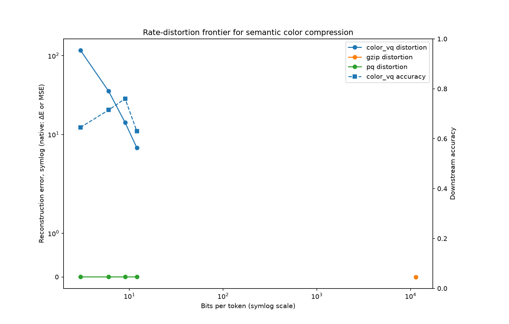
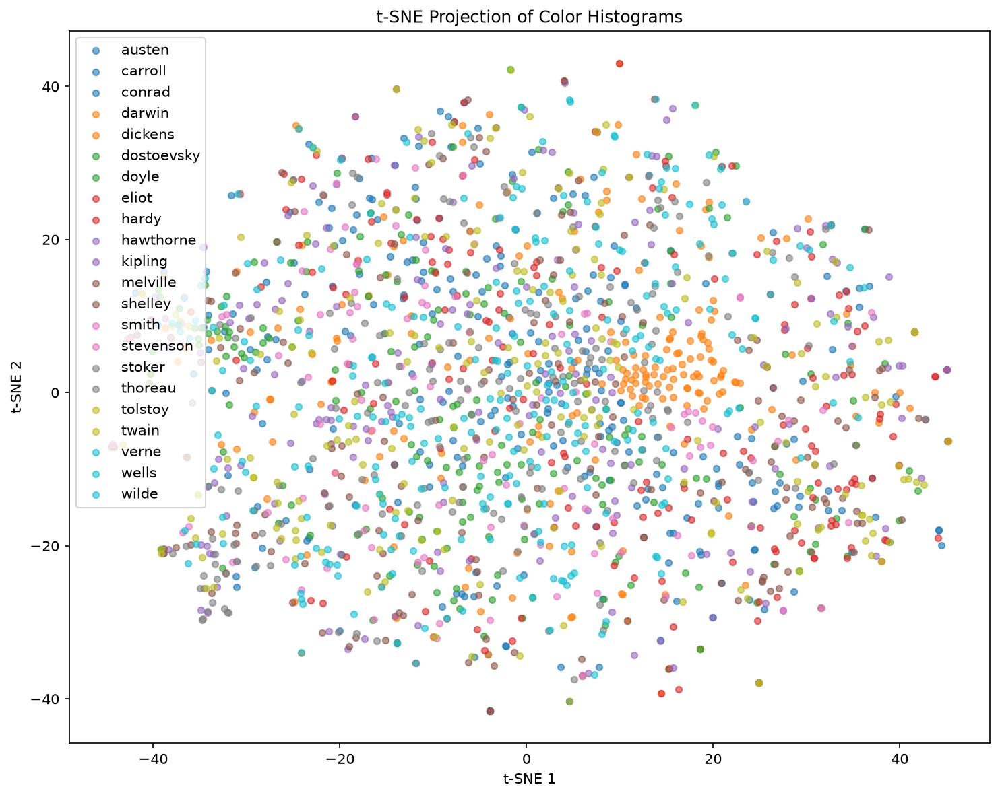
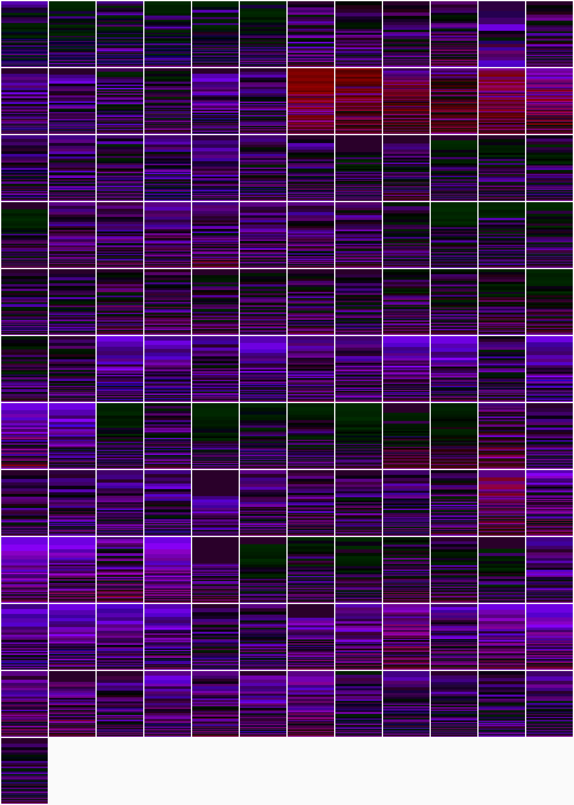
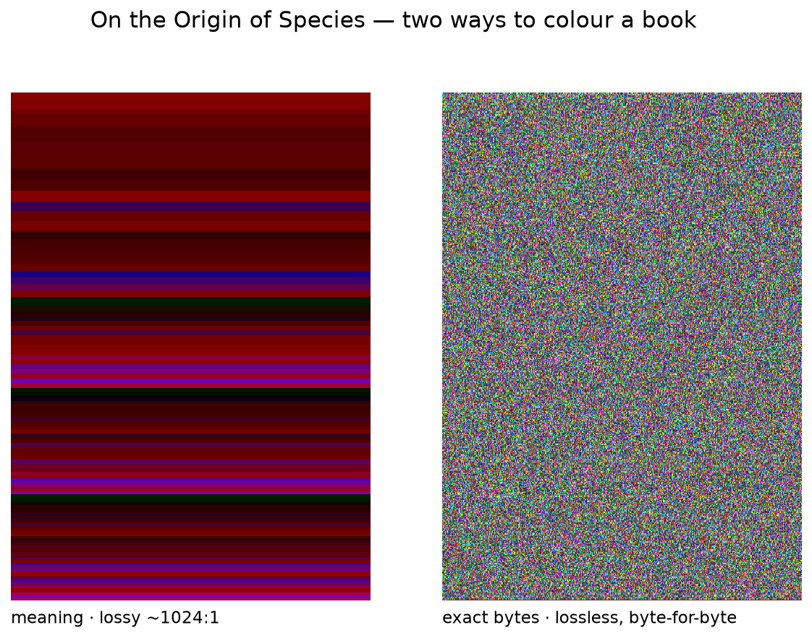
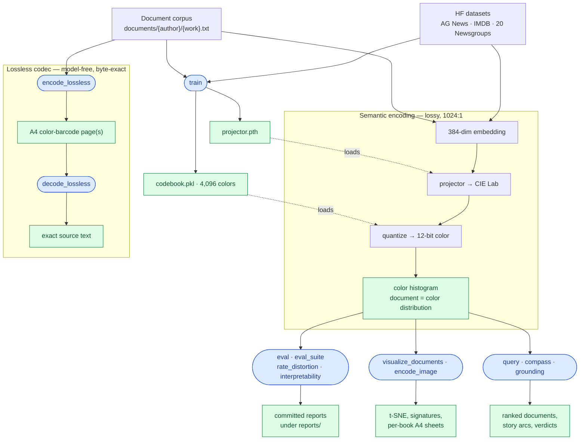
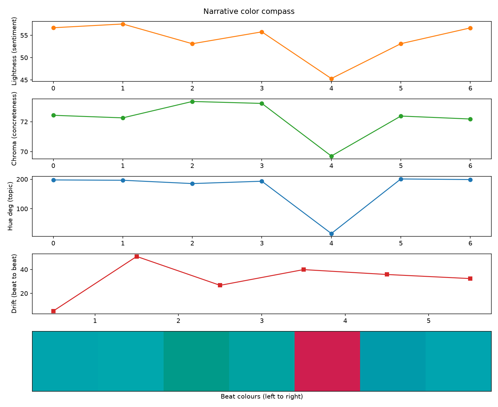

# Colors of Meaning

[](https://github.com/Qualis/colors-of-meaning/actions/workflows/builder.yml)
[](https://github.com/Qualis/colors-of-meaning/actions/workflows/development.yml)
[](https://github.com/Qualis/colors-of-meaning/actions/workflows/service.yml)
[](https://github.com/Qualis/colors-of-meaning/actions/workflows/pr-gate.yml)

**Machine synesthesia for semantic compression and retrieval.** A sentence embedding becomes one
12-bit color, a document becomes a distribution of colors, and that distribution still classifies,
retrieves, and reads as an image — at 1024:1 compression.

## What this is

An implementation of the [Colors of Meaning](https://www.qual.is/posts/colors-of-meaning)
experiment. A neural projector maps a 384-dim sentence-transformers embedding to one CIE Lab
color, quantized against a fixed 4,096-color palette. A 384-dim float32 embedding is 12,288 bits;
one palette code is 12 bits — an exact 1024:1 ratio. A document is then a *distribution* over
those colors (a histogram), and documents are compared by perceptual Earth-Mover distance in Lab
space rather than by cosine similarity in 384 dimensions.

```
text → embedding (384-dim) → projector → Lab color → palette code (12-bit) → color histogram
```

The article describes 768-dim embeddings at ~2000:1. This repository ships the 384-dim model, so
the exact ratio here is 1024:1.

## Results

Every number below is regenerated from a committed command into a committed report. All three
methods run at the same sample budget and seed 42, re-ranked with a fidelity-gated
sliced-Wasserstein proxy — [`reports/eval_results.md`](reports/eval_results.md).

| Dataset | Method | Accuracy | Macro F1 | Bits/token | MRR | Recall@5 |
|---|---|---|---|---|---|---|
| **AG News** (4-class, 4,000) | Color | 81.75% | 81.78% | 12 | 0.85 | 0.94 |
| | TF-IDF | 86.30% | 86.24% | — | — | — |
| | HNSW | 88.90% | 88.90% | 12,288 | 0.90 | 0.97 |
| **IMDB** (2-class, 600) | Color | 54.83% | 54.78% | 12 | 0.72 | 0.97 |
| | TF-IDF | 77.67% | 77.65% | — | — | — |
| | HNSW | 64.17% | 62.65% | 12,288 | 0.76 | 0.95 |
| **20 Newsgroups** (20-class, 600) | Color | 16.50% | 15.35% | 12 | 0.28 | 0.43 |
| | TF-IDF | 45.17% | 40.58% | — | — | — |
| | HNSW | 58.67% | 56.37% | 12,288 | 0.64 | 0.81 |

On AG News, color classifies 4.6 points below TF-IDF and 7.2 below HNSW while storing 1,024×
less per token. Retrieval is scored on its own ranking: by the same perceptual distance the
classifier uses, color reaches MRR 0.85 and recall@5 0.94 against HNSW's 0.90 and 0.97. Relevance
is label-based — a same-class document surfacing near the query, the standard metric-learning
Recall@K convention. TF-IDF is classification-only and is skipped under `--task retrieval`.

The projector is trained on AG News and applied unchanged elsewhere, so the other two rows
measure transfer. Topic-trained colors do not encode sentiment: IMDB lands at 54.83%, barely
above the 50% binary chance rate. 20 Newsgroups reaches 16.50%, 3.3× the 5% chance rate. On IMDB
the full-precision embedding baseline also trails TF-IDF, so part of that gap belongs to the
embedding rather than the color bottleneck. Per-dataset retraining is not done.

Scaled runs substitute a sliced-Wasserstein proxy for exact Earth-Mover distance, which costs
~92 ms per call. A fidelity gate runs first and fails the suite loudly if that changes the
answer: Spearman 0.9924 over 1,500 held-out pairs (threshold 0.95) and an accuracy delta of 0.0
points (threshold 1.0). The proxy is ~200× faster on these sparse histograms.

**How much structure survives.** The Spearman correlation between embedding cosine similarity and
color distance is ρ = −0.3904, printed by `train`. It is negative by design — closer meanings map
to closer colors — and −1 would be perfect preservation, so |ρ| ≈ 0.39 is weak-to-moderate
neighborhood preservation: real structure survives the 12-bit color, and a meaningful share is
lost.

### Authorship on real prose

A Project Gutenberg corpus of 22 authors and 133 works is a first-class dataset source: the
parent directory is the label, and whole works are held out per author, so accuracy measures
generalization to unseen books rather than memorization of one. A projector trained and
validation-selected on it reaches **10.8%** held-out 22-way authorship accuracy — 2.4× the 4.5%
chance rate — against 37.2% for full-lexical TF-IDF. That gap is what 12 bits per sentence costs.

More training data helps. An 8-seed sweep over the paragraphs-per-work cap moves accuracy from
0.127 at 60 to 0.141 at 150 and 0.183 at 300 (+0.057 overall, 1.45×), with most of the gain
between 150 and 300 — [`reports/documents_authorship.md`](reports/documents_authorship.md).

### Rate–distortion



The 1024:1 headline is one operating point. Sweeping the bit budget turns it into a measured
frontier against gzip and Product Quantization at matched budgets. Color-VQ's mean ΔE falls from
117.2 at 3 bits to 6.8 at 12 bits, while gzip stays lossless at ~11,400 bits/token. Downstream
retrieval accuracy peaks at 9 bits (76.0%) and drops at 12 (63.0%), so past 9 bits the extra
resolution costs accuracy as well as space —
[`reports/rate_distortion.md`](reports/rate_distortion.md), and the same sweep over the authored
corpus in [`reports/documents_rate_distortion.md`](reports/documents_rate_distortion.md).

```bash
tox -e rate_distortion -- --dataset ag_news --budgets 2 4 8 16 --methods color_vq gzip pq --with-accuracy --distance jensen_shannon --max-samples 200 --config configs/base.yaml
```

### Interpretable axes

The structured mapper trains hue toward topic clusters, lightness toward sentiment, and chroma
toward concreteness, which makes those axes true by construction on the training split and
therefore proves nothing. On a held-out split, measured against an untrained noise projector as a
negative control, all three clear their margin: hue↔topic NMI 0.129 against 0.001,
lightness↔sentiment 0.572 against −0.003, chroma↔concreteness 0.331 against −0.037. The verdict is
VALIDATED; an axis that failed would be reported as a falsification —
[`reports/interpretability.md`](reports/interpretability.md).

```bash
tox -e interpretability -- --config configs/interpretability.yaml --dataset imdb --structured-model artifacts/models/structured_projector.pth --control noise
```

### Measured against the article

| The article proposed | Where this landed |
|---|---|
| Full pipeline: Lab mapping → 4,096-color palette → color-histogram documents → Wasserstein retrieval, with topic, sentiment, and search tasks | Shipped |
| Interpretable hue / lightness / chroma axes | Shipped, and validated against a negative control |
| ~2,000:1 compression, assuming 768-dim embeddings | Partial: an exact 1024:1 at the shipped 384-dim model |
| "Competitive accuracy with dramatically less space" | Partial: the space holds, the accuracy trails, and the cost is quantified on a rate–distortion frontier |
| Lossless storage (the article is lossy-only) | Beyond the article: a byte-exact A4 color-barcode codec |
| Other perceptual modalities (sound, touch, taste) | Future work |

## Limitations

- Color classification trails TF-IDF and HNSW at every matched budget measured here. The
  compression is real and so is the accuracy cost.
- The committed projector is trained on AG News. It transfers weakly to sentiment and modestly to
  20-class topic.
- The `documents/` corpus is git-ignored, so authorship results, per-book figures, and
  documents-sourced sweeps are local opt-in runs. The AG News results are the CI-reproducible
  ones.
- Book generation needs a live API key and a non-deterministic model, so it is the one artifact
  here with no reproducible command.
- The grounding audit is a distributional off-context signal, not a factuality or citation
  checker. A small divergence says an answer's colors sit inside its retrieved context, not that
  the answer is correct.
- The A4 semantic sheet round-trips only approximately on the full 4,096-color palette, because
  the palette includes out-of-gamut Lab points that `lab_to_rgb` clips. It is exact on a coarse
  in-gamut palette.

## Gallery

Authors settle into color neighborhoods, and every book becomes an A4 color signature — one cell
per book, ordered by author:





The same book, colored two ways: its meaning at 1024:1, and its exact bytes.



The right-hand page decodes. Download the one below and recover the full text of *A Christmas
Carol*, byte-for-byte:

```bash
tox -e decode_lossless -- --input-paths reports/figures/lossless_a_christmas_carol.png
```


All 133 works round-trip with zero failures in a local run; the CI-reproducible proof is this
committed page and the codec's round-trip test suite. Every per-book sheet and barcode page is in
the [image gallery on Google Drive](https://drive.google.com/drive/folders/1kfENTLEe_Zaw6Q4kcgwTYXuDQwNAo9ap).

## Pipeline

Processes in blue, artifacts in green — a lossy semantic path at 1024:1, and a separate
model-free lossless codec:



`train` produces the projector and the codebook; the encoder loads both to turn any document into
a color histogram, and the downstream commands turn that histogram into reports, figures, and A4
sheets. The lossless codec shares none of it: `text → DEFLATE → color-barcode pages` needs no
trained artifacts at all.

## Quick start

```bash
colima start --cpu 2 --memory 2 --vm-type=vz --mount-type=virtiofs --dns 8.8.8.8
vagrant up && vagrant ssh
tox                    # every quality gate, the test suite, 100% coverage
```

From there, [Reproducing the results](#reproducing-the-results) regenerates the tables above, and
the section below is what else the pipeline does. The baselines need no trained artifacts:
`tox -e eval -- --dataset ag_news --method tfidf`.

## What you can do with it

Every command below has its full flag list in [`docs/cli.md`](docs/cli.md).

**Query by color palette.** Retrieve documents by naming Lab colors and weights, from the CLI or
`POST /query/palette`.

```bash
tox -e query -- --palette-json '[{"l": 75, "a": 20, "b": -10, "weight": 1.0}]' --k 5
```

**Render a document as an A4 sheet.** One printable page of a document's color distribution at
true A4 size (2480×3508 px at 300 DPI, DPI metadata embedded). The `score` layout is decodable:
re-reading the page recovers a histogram close enough to retrieve the source document. The source
*text* is not recoverable — the 384→3 projection is lossy by design.

```bash
tox -e encode_image -- --text "Markets fell sharply today." --layout score
tox -e decode_image -- --image-path reports/figures/document_a4.png --encoded-documents artifacts/encoded/test_documents.pkl
```

**Store a document losslessly.** A model-free color barcode: `text → UTF-8 → DEFLATE →
CRC-framed pages → A4 PNG`. No embedding, projector, or palette is involved, so it needs no
trained artifacts and returns the exact bytes. Long documents split across the minimum number of
pages, each self-describing its index and count, so pages decode in any order and a missing or
corrupt page raises rather than returning wrong text. Losslessness holds for the digital
round-trip; print-and-scan robustness is out of scope.

```bash
tox -e encode_lossless -- --input-path reports/austen_pride.txt
tox -e decode_lossless -- --input-paths "reports/figures/austen_p*.png"
```

**Compare corpora by color.** Per-corpus color signatures and a shared t-SNE for several labelled
text corpora.

```bash
tox -e visualize_corpus -- --corpus-specs "Darwin=data/darwin.txt,Austen=data/austen.txt"
```

**Read a story as a color trajectory.** The narrative compass reads each beat of an ordered
outline as a color: taken from the beat's whole-text embedding, so lightness tracks sentiment,
chroma tracks concreteness, and hue tracks topic. Each beat is also a histogram, giving drift
between consecutive beats and coherence against the whole-book palette. The committed sample is a
seven-chapter seafaring arc with a *Quarterly Earnings Review* dropped into it, and the compass
isolates that beat: hue 16° where every narrative chapter sits between 185° and 201°, the lowest
lightness, and the largest distance from the book's palette.



```bash
tox -e compass -- --outline outlines/sample_story.md --config configs/structured.yaml --model-path artifacts/models/structured_projector.pth --mapper structured --metric sliced --drift-threshold 36.5
```

**Audit RAG grounding.** Encode an answer and its retrieved passages as color histograms and
measure the answer's distance from the passage mixture — a cheap off-context signal. On the
committed sample, a grounded answer scores 12.24 and an off-context answer about interest rates
scores 49.53, against a threshold of 25.

```bash
tox -e grounding -- --sample samples/rag_grounding.yaml --config configs/base.yaml --mapper plain --metric sliced --threshold 25
```

**Write a book and audit it.** The projector is a lossy encoder that never runs in reverse, so it
cannot write. `generate` pairs Claude — behind a provider-agnostic `TextGenerator` port — with
the compass: the model plans an outline and writes each chapter with the preceding ones in
context, while the compass audits the color arc after every beat. A chapter that drifts past the
threshold is rewritten with a corrective note, up to a bounded retry budget, and flagged if it
still drifts. In one run, `claude-opus-4-8` wrote six ~520-word chapters (~16.1k input / 7.2k
output tokens) with zero regenerations and zero flags, coherence 5.6–18.2 against a threshold of
25, lightness and hue dipping through the flashback and the crisis and recovering at the finale.
Needs `ANTHROPIC_API_KEY`; not run in CI.

```bash
export ANTHROPIC_API_KEY=sk-ant-...
tox -e generate -- --summary "A lighthouse keeper befriends the ghost of a drowned sailor." --num-beats 6 --words-per-beat 500
```

**Run it on your own prose.** Drop UTF-8 files under `documents/<author>/<work>.txt`. The parent
directory names the author and becomes the label, Project Gutenberg boilerplate is stripped, and
paragraphs become samples. Whole works are held out per author into train / validation / test
(0.2 / 0.2 by default, so roughly 60/20/20). Authors with fewer than three works fall back to a
paragraph-level split, and authors yielding fewer than three qualifying paragraphs are skipped.

```bash
tox -e rate_distortion -- --source documents --documents-dir ./documents --with-accuracy
tox -e authorship -- --config configs/documents.yaml --mapper-type supervised --paragraphs-per-work 60
```

## Reproducing the results

The 400-sample headline — 81.25% accuracy, 81.22% macro F1, with an exact Earth-Mover re-rank
rather than the sliced proxy — comes from [`configs/agnews_run.yaml`](configs/agnews_run.yaml),
which pins `training.seed: 42`, `training.device: cpu`, `dataset.max_samples: 400`, the
4,096-color codebook, and exact perceptual Lab EMD (`distance.sinkhorn_reg: null`):

```bash
tox -e train -- --config configs/agnews_run.yaml --mapper-type supervised
tox -e eval -- --dataset ag_news --method color --config configs/agnews_run.yaml --mapper-type supervised
```

Training prints `Structure-preservation correlation: -0.3904`. At that same 400-sample budget
TF-IDF scores 82.00% / 81.79% and HNSW 85.25% / 85.14%:

```bash
tox -e eval -- --dataset ag_news --method tfidf --config configs/agnews_run.yaml
tox -e eval -- --dataset ag_news --method hnsw --config configs/agnews_run.yaml --k-neighbors 5
```

The scaled, multi-dataset table at the top of this file comes from one command, which runs the
fidelity gate before it trusts a single proxy-ranked number:

```bash
tox -e eval_suite -- --datasets ag_news imdb newsgroups --distance sliced --budgets 4000 600 600 --config configs/agnews_full.yaml --mapper-type unconstrained
```

Trained artifacts land under `artifacts/` and are git-ignored: `models/projector.pth`,
`codebooks/codebook_4096.pkl`, `encoded/test_documents.pkl`.

**Tolerance.** Training honours `training.seed`, so on the reference environment — CPU, PyTorch
2.x, the locked dependency set — re-running regenerates bit-identical weights and therefore the
exact numbers above; the evaluation is deterministic given those weights. Across different
hardware or library versions expect up to ±1 point on accuracy and ±0.02 on the correlation,
which `--deterministic` tightens further.

Everything under `reports/` regenerates from a committed command: `./bin/generate` runs each
report's own Reproduce command (`--list`, `--dry-run`, `--only <stage>`). The 24-training
authorship sweep is the exception in cost — a vectorised selection pass took it from a projected
626 h to about 7 h, and it reads from a committed manifest unless `--refresh-scaling` is passed
([measurements](.specs/038-authorship-sweep-performance/BENCHMARK.md)).

## Development

Tested with `vagrant` 2.4.3, `ansible` 2.18.3, `colima` 0.8.1, and `docker` 28.0.2. Dependencies
are managed with `uv`; `pyproject.toml` and `uv.lock` are both committed, and `tox` installs from
the lock.

| Command | What it does |
|---|---|
| `tox` | Every quality gate, the full test suite, 100% coverage |
| `tox -e format` | Format with ruff |
| `tox -e watch` | Re-run affected tests on change |
| `./bin/run-local -c` | Run the API locally |
| `./bin/generate` | Regenerate every artifact under `reports/` |

Every science and visualization command is in [`docs/cli.md`](docs/cli.md). Shell scripts are
checked with `shellcheck -x ./*.sh bin/*` and playbooks with
`ansible-lint -p infrastructure/ansible/playbook-*.yml`.

The quality gates are ruff check, ruff format, bandit, semgrep, radon, xenon, mypy, and
pip-audit, all passing, with 100% test coverage enforced. Use `tox` rather than `pytest` directly
— `pytest` alone skips eight of those gates.

### API authentication

The basic-auth path never stores or ships a plaintext password. The admin credential is supplied
at runtime as an Argon2id hash in `APP_ADMIN_PASSWORD_HASH`; no usable credential is committed.

```bash
export APP_ADMIN_PASSWORD_HASH="$(python -m colors_of_meaning.interface.cli.hash_password)"
```

The command prompts for a password without echoing it and prints only the hash. With the variable
exported, authenticate as `admin` (override with `APP_ADMIN`) using that password. If the variable
is unset the authenticator fails closed: every login is refused and a warning is logged.

## Architecture

Hexagonal architecture (ports and adapters) with domain-driven design, enforced by `pytest-archon`
tests rather than convention:

- **Domain** — entities, repository and service interfaces as ABCs. No frameworks, no I/O.
- **Application** — use cases that orchestrate domain services, with dependencies injected.
- **Infrastructure** — adapters implementing the domain ports: ML mappers and distance
  calculators, dataset adapters, classifiers and retrievers, visualization, persistence,
  security, health.
- **Interface** — FastAPI controllers with Pydantic DTOs, and `tyro` CLIs.
- **Shared** — configuration and Lab color utilities.

Layer inventory, design rationale, and the evaluation strategy are in
[`docs/design.md`](docs/design.md). The full command reference is [`docs/cli.md`](docs/cli.md).
The coding standards and architectural rules the suite enforces are in
[`.claude/CLAUDE.md`](.claude/CLAUDE.md), and the development skills that support them are in
[`.claude/skills/`](.claude/skills/README.md).

Dependency injection uses [Lagom](https://github.com/meadsteve/lagom). Logging is structured with
correlation IDs. Service interactions are covered by consumer-driven contract tests. Images are
multi-arch (amd64, arm64), built with Packer and Ansible.

## Contributing

1. Read [`.claude/CLAUDE.md`](.claude/CLAUDE.md) for the coding standards and architectural rules.
2. Keep coverage at 100% and respect the layer boundaries.
3. One logical assertion per test, named `test_should_<behaviour>_when_<condition>`.
4. Run `tox -e format`, then `tox`, before committing.
