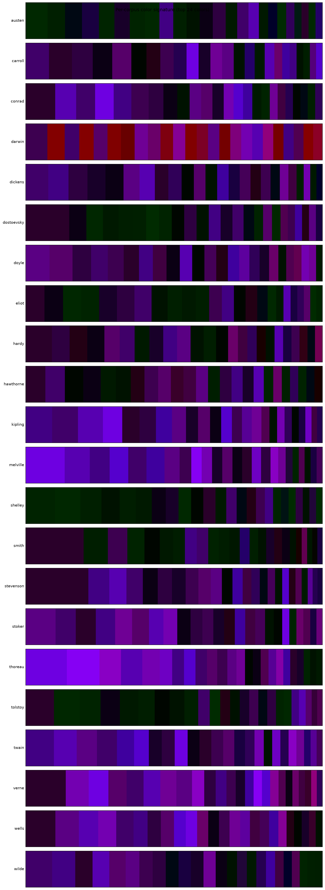

# Authorship by colour: training, evaluating and testing against `documents/`

This report trains the semantic-colour projector on a real authored-document corpus and
measures how much authorship signal survives the ~1024:1 compression of each paragraph's
meaning into a distribution over a 4,096-colour palette (12 bits/token). It is generated
from the local, git-ignored `./documents/` corpus and is **not** CI-reproducible (unlike
the AG-News [`eval_results.md`](eval_results.md) / [`rate_distortion.md`](rate_distortion.md)
reports); regenerate it locally with the commands at the end.

## Corpus

`documents/<author>/<work>.txt` — 22 Project Gutenberg authors, 133 works:

| author | works | author | works |
|---|---|---|---|
| austen | 6 | kipling | 6 |
| carroll | 6 | melville | 6 |
| conrad | 6 | shelley | 6 |
| darwin | 6 | smith | 3 |
| dickens | 7 | stevenson | 6 |
| dostoevsky | 6 | stoker | 6 |
| doyle | 7 | thoreau | 6 |
| eliot | 6 | tolstoy | 6 |
| hardy | 6 | twain | 7 |
| hawthorne | 6 | verne | 6 |
| wells | 7 | wilde | 6 |

The author is the class label. Works are stripped of Gutenberg boilerplate, split into
paragraphs, globally de-duplicated, and partitioned by a **work-level three-way holdout**
(whole works held out per split, so no test-work paragraph is ever seen in training). The
number of paragraphs kept per work is the `paragraphs_per_work` cap; it is now a
`configs/documents.yaml` value (`dataset.paragraphs_per_work`, default **300**, overridable
with `--paragraphs-per-work`). At the cap-300 default the training corpus is:

| split | paragraphs |
|---|---|
| train | 25,452 |
| validation | 6,096 |
| test | 6,568 |

The split is deterministic and leakage-free (train ∩ validation ∩ test = ∅, verified).

## Method

A **supervised author-contrastive projector** (384-dim sentence embedding → 3-dim CIE Lab)
is trained on the train split: same-author paragraphs are pulled together in Lab space and
different authors pushed apart, with an auxiliary 22-way classification head. The epoch
checkpoint is **selected on the validation split** by colour-histogram authorship accuracy
(the same metric reported on test) — not by structure preservation, which is
counterproductive here because the contrastive objective deliberately reorganises colour by
author. The selected checkpoint scored **0.167 on validation**.

## Held-out test results

22-way authorship on the held-out test works (chance = 1/22 = 0.045). To keep the
colour-histogram k-NN tractable, accuracy is measured on the standard cap-60 held-out
corpus (5,340-paragraph reference / 1,320-paragraph test):

| method | bits/token | test accuracy | macro-F1 |
|---|---|---|---|
| **colour — validation-selected projector** | 12 | **0.108** | 0.106 |
| TF-IDF (full lexical features) | — | 0.372 | 0.347 |
| chance | — | 0.045 | — |

A real authorship signal — **~2.4× chance** — survives compressing each paragraph's meaning
into a 12-bit colour, now across a harder 22-author field. Full-lexical TF-IDF is ~3.4×
better, which is the honest cost of the compression: colour keeps semantic *shape*, TF-IDF
keeps every word. See [Data scaling](#data-scaling-does-more-training-data-help) for the
multi-seed evidence that this colour signal grows with training data.

## The texts as colours

Each author's paragraphs, encoded to colour distributions by the trained projector and
projected to 2-D — authors separate into colour neighbourhoods:


Per-author colour signatures (the dominant palette colours for each author):



### A4 colour image per book

Each of the 133 works is rendered as an A4 colours-of-meaning sheet — horizontal bands of
the book's palette colours, sized by how often the trained projector maps the book's
sentences to each colour (the `signature` layout, computed over the book's leading
paragraphs). The contact sheet below shows all 133, ordered by author so an author's works
sit together (the individual per-book sheets are the [`figures/a4/`](figures/a4/)
`<author>__<work>.png` files):


Darwin's scientific prose (`coral_reefs`, `origin_of_species`, `the_descent_of_man`,
`voyage_of_the_beagle`) renders as a distinctive bright-red block, visibly separated from
the dark blue/purple/magenta of the fiction — the colour signature picks up the
science/fiction register even before authorship.

### Lossless A4 colour-barcode representation

The signatures above are a *lossy, semantic* rendering. Separately, the lossless codec
(`encode_lossless` / `decode_lossless`) stores each book's **exact text** as printable A4
colour-barcode page(s) that decode back **byte-for-byte**. These barcode images are dense
data and are **not committed** — they are git-ignored, regenerable local artifacts.
Regenerate and verify one with:

```bash
tox -e encode_lossless -- --input-path documents/austen/pride_and_prejudice.txt \
  --output-path reports/figures/lossless/austen__pride_and_prejudice.png --dpi 300
tox -e decode_lossless -- --input-paths reports/figures/lossless/austen__pride_and_prejudice.png
```

## Data scaling: does more training data help?

The `paragraphs_per_work` cap controls how much of each book enters training. Raising it
un-throttles the same books (each book holds hundreds of qualifying paragraphs). Training
the val-selected supervised projector at increasing caps and measuring held-out authorship
accuracy on the **same** fixed cap-60 test set (8 seeds each; mean ± population std):

| `paragraphs_per_work` | train paragraphs | test accuracy (mean ± std) | × chance |
|---|---|---|---|
| 60 | 5,340 | 0.092 ± 0.016 | 2.02× |
| 150 | 13,339 | 0.128 ± 0.022 | 2.80× |
| 300 | 25,452 | 0.149 ± 0.023 | 3.28× |

Accuracy rises monotonically with training data, and the cap-60 → cap-300 gap (+0.057) is
~2.4× the per-point standard deviation — so the effect is robust across seeds, not a
single-run artifact. Un-throttling the *same* books (raising the cap) is the lever; no new
text was needed. (8 seeds each; population std; the held-out cap-60 test set is held fixed
across all runs, so only the training-data volume varies.)

## Reproduce (local; requires `./documents/`)

```bash
# train the author-contrastive projector at the config-default cap (paragraphs_per_work: 300),
# selecting the checkpoint on validation
tox -e train -- --source documents --mapper-type supervised --config configs/documents.yaml \
  --select-on validation \
  --output-model artifacts/models/projector_documents_valsel.pth --output-codebook codebook_documents_valsel

# held-out test accuracy (colour method) and the TF-IDF baseline, on the cap-60 held-out corpus
tox -e eval -- --source documents --method color --mapper-type supervised --config configs/documents.yaml \
  --paragraphs-per-work 60 \
  --model-path artifacts/models/projector_documents_valsel.pth --codebook-path codebook_documents_valsel \
  --distance jensen_shannon
tox -e eval -- --source documents --method tfidf --config configs/documents.yaml --paragraphs-per-work 60
```
