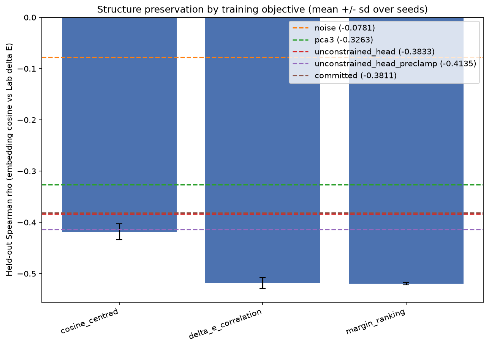

# Structure objective alignment

The projector is scored on Spearman rho between embedding cosine similarity and Lab Euclidean distance,
but it has always been trained on a different quantity. This report measures each candidate training
objective on the metric it is judged by, and bounds what three dimensions can hold at all with untrained,
linear and unconstrained-head controls, so the residual can be attributed rather than assumed.

Every arm is trained on the training split, its checkpoint selected on a held-out selection slice, and
its rho reported on a disjoint held-out slice. rho is negative by design: closer meanings, closer colors.

Library versions: numpy 2.4.6, scikit-learn 1.9.0, torch 2.12.1+cpu.

## Objective arms

The `seeds` column counts the seeds the correlation was averaged over; the downstream columns are averaged
over the smaller downstream seed set named in the command below, and are measured only for the nominated
arms, so an unnominated arm reads n/a rather than zero.

| arm | mean rho | sd rho | seeds | accuracy | macro_f1 | mrr | recall@k |
|---|---|---|---|---|---|---|---|
| cosine_centred | -0.4182 | 0.0156 | 8 | 0.6296 | 0.6056 | 0.6536 | 1:0.5363 5:0.8255 10:0.8773 |
| delta_e_correlation | -0.5186 | 0.0105 | 8 | n/a | n/a | n/a | n/a |
| margin_ranking | -0.5196 | 0.0024 | 8 | 0.7351 | 0.7361 | 0.7738 | 1:0.6744 5:0.9077 10:0.9429 |



## Ceiling controls

`noise` is an untrained projector (floor), `pca3` an untrained linear projection rescaled per axis into the
Lab ranges, and `unconstrained_head` the same architecture with the Lab sigmoid/tanh head removed, reported
both pre-clamp (roadmap R-2, the gamut constraint isolated) and post-clamp (what the pipeline receives).
`committed` is the shipped projector artifact read straight off disk and scored on the same held-out slice,
so every number above can be read against the one the repository already publishes. It is a single fixed
artifact and the PCA fit is deterministic, so the zero seed spread of `committed` and `pca3` is a property
of those controls rather than a measurement. Two further caveats: the pre-clamp figure is a lower bound on
the unconstrained-head ceiling, because the checkpoint it reads was selected on the post-clamp score; and
`pca3` is rescaled per axis as the specification pre-registers, which is not rank-preserving, so read it as
a same-recipe comparator rather than as a bound on what any linear map could reach.

| arm | mean rho | sd rho | seeds | accuracy | macro_f1 | mrr | recall@k |
|---|---|---|---|---|---|---|---|
| noise | -0.0781 | 0.0207 | 8 | n/a | n/a | n/a | n/a |
| pca3 | -0.3263 | 0.0000 | 8 | n/a | n/a | n/a | n/a |
| unconstrained_head | -0.3833 | 0.0359 | 8 | n/a | n/a | n/a | n/a |
| unconstrained_head_preclamp | -0.4135 | 0.0328 | 8 | n/a | n/a | n/a | n/a |
| committed | -0.3811 | 0.0000 | 8 | 0.8106 | 0.8109 | 0.8343 | 1:0.7582 5:0.9324 10:0.9648 |

## Pre-registered adoption rule

An arm replaces the committed projector only if its mean held-out |rho| exceeds `cosine_centred`'s
by more than 2 times the pooled seed standard deviation *and* its
accuracy is no more than 1.0 points below it. The rule was fixed
before the run. A margin needs a measurable seed spread: when both arms have zero spread the margin is
reported as n/a and no arm is adopted, because a single seed cannot separate a gain from noise.

| challenger | mean rho | margin over baseline (pooled sd) | clears rule |
|---|---|---|---|
| delta_e_correlation | -0.5186 | 7.52 | no - accuracy not measured |
| margin_ranking | -0.5196 | 9.06 | yes |

**Adopted arm: `margin_ranking`.** It clears the pre-registered rule against `cosine_centred` by 9.06 pooled seed sd, so it is the objective this family should be trained on. The shipped artifact is nevertheless left in place: it is produced by the supervised mapper, which owns a different loss and is out of scope here, and at the same budget it scores 0.8106 against the adopted arm's 0.7351. Replacing it would trade a better correlation for a worse task result, which is the outcome the accuracy guard exists to refuse.

## Reproduce

```bash
tox -e compare_objectives -- --dataset ag_news --arms cosine_centred delta_e_correlation margin_ranking --controls noise pca3 unconstrained_head unconstrained_head_preclamp committed --seeds 42 43 44 45 46 47 48 49 --downstream-top-k 2 --downstream-controls committed --downstream-seeds 42 43 44 --budget 4000 --distance sliced --k-neighbors 5 --k-values 1 5 10 --adoption-threshold-sigma 2.0 --max-accuracy-drop 0.01 --config configs/agnews_run.yaml --codebook-path codebook_4096 --committed-model-path artifacts/models/projector.pth --selection-samples 256 --structure-samples 256 --output-path reports/structure_objective.md --figure-path reports/figures/structure_objective.png
```
